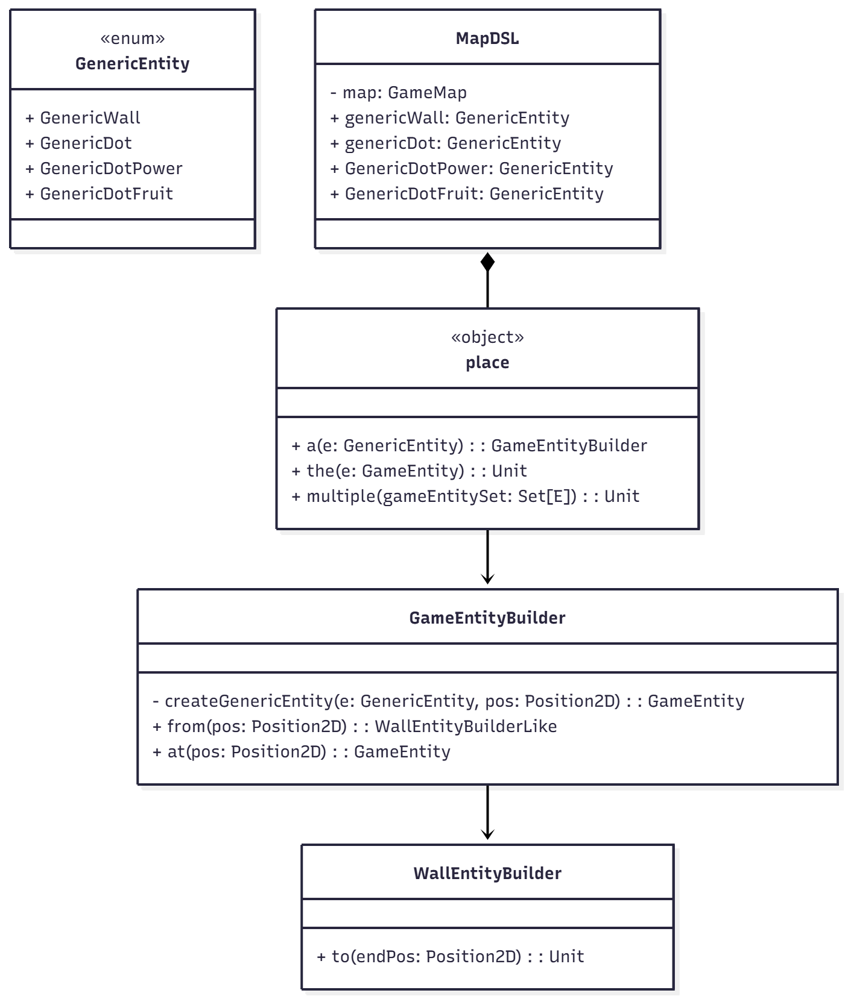
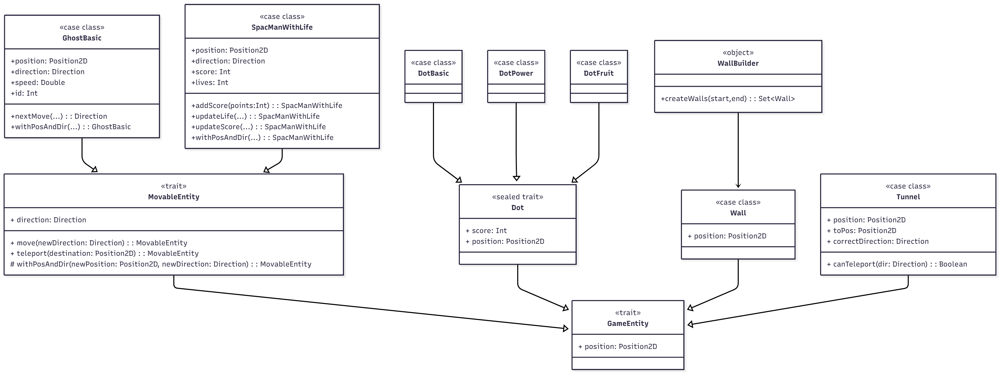

# Design di dettaglio

## Model

### Creazione mappa

Per la creazione della mappa si è optato per l'utilizzo dei **Factory Methods**, in particolare l'oggetto `GameMapFactory` permette la creazione di mappe vuote. 
Per agevolare e velocizzare il riempimento delle mappe(anche in funzione dei test), si è deciso di creare un **DSL**. Esso permette di posizionare le entità di dominio all'interno della mappa con un linguaggio naturale e più veloce. Inoltre offre la possibilità di creare e collocare nella mappa file di muri.

### Creazione entità del gioco

Qualsiasi entità di gioco viene rappresentata nell'applicazione come un'interfaccia di tipo `GameEntity`. Essa viene poi estesa dall'interfaccia `MovableEntity` per tutte le entità in grado di muoversi all'interno della mappa. Essendo i componenti di gioco molto semplici è stato deciso di definirli come case class, quindi dotate in automatico di metodi (come **apply**) per la creazione dell'oggetto. 

L'unica di queste entità per cui è stato utilizzato l'approccio dei **Factory Methods** è il `Wall`, grazie alla quale è possibile creare interi set di muri continui a partire solamente da due posizioni.

### Game Manager

### Ghost Behavior

## Controller

### Game Loop

### Input Manager

Responsabilità: Validare e interpretare l’input grezzo dell’utente
Componenti:
InputSystem: Riceve le coordinate grezze del mouse click dalla GameView (inoltrate tramite ViewController e GameController)
InputProcessor: Contiene la logica per verificare se un click (MouseClick) ricade all’interno dell’area valida della griglia (isInGridArea)
ClickResult: case class che rappresenta l’esito della validazione dell’input (posizione valida/invalida, eventuale messaggio di errore)
GridMapper: Utilizzato per convertire le coordinate fisiche (pixel) in coordinate logiche (riga/colonna) se il click è valido. L’EventHandler riceverà poi un GridClicked event con le coordinate logiche

## View

### 

0. [Introduzione](../README.md)
1. [Processo di sviluppo](1-processo.md)
2. [Requisiti](2-requisiti.md)
3. [Design architetturale *(prev)*](3-architettura.md)
4. [Design di dettaglio](4-design-dettaglio.md)
5. [**Implementazione (next)**](5-implementazione.md)
6. [Testing](6-testing.md)
7. [Retrospettiva](7-retrospettiva.md)
