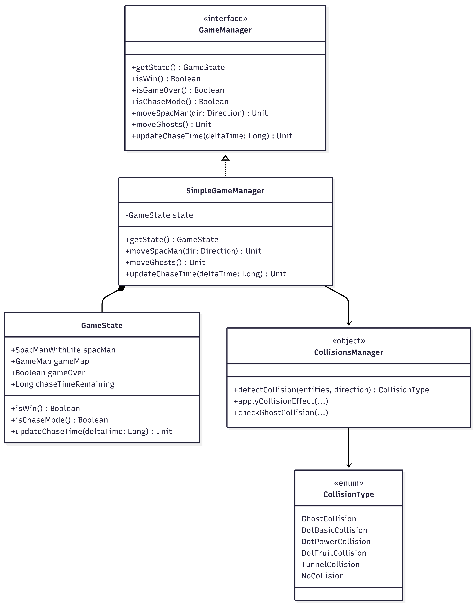
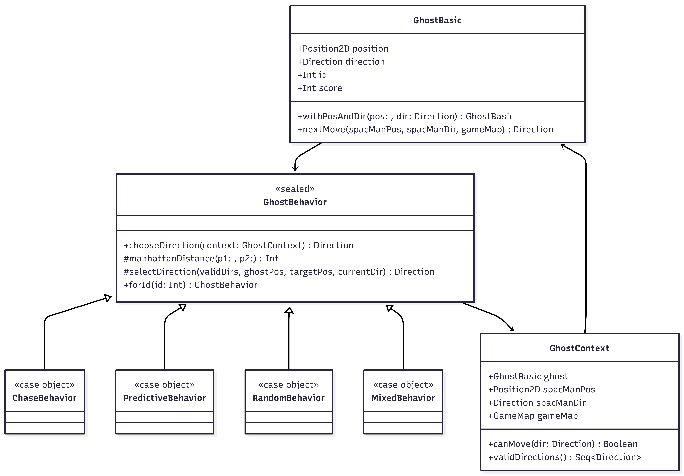
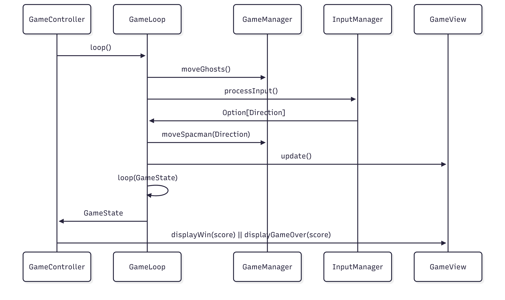
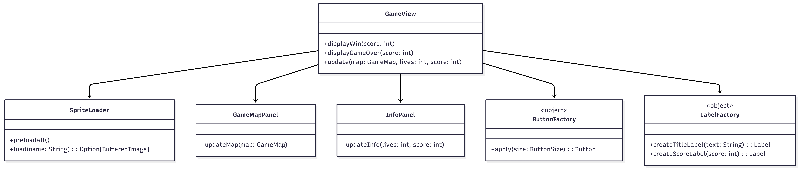

# Design di dettaglio

## Model

### Creazione mappa

Per la creazione della mappa si è optato per l'utilizzo dei **Factory Methods**, in particolare l'oggetto `GameMapFactory` permette la creazione di mappe vuote. 
Per agevolare e velocizzare il riempimento delle mappe(anche in funzione dei test), si è deciso di creare un **DSL**. Esso permette di posizionare le entità di dominio all'interno della mappa con un linguaggio naturale e più veloce. Inoltre offre la possibilità di creare e collocare nella mappa file di muri.

### Creazione entità del gioco

Qualsiasi entità di gioco viene rappresentata nell'applicazione come un'interfaccia di tipo `GameEntity`. Essa viene poi estesa dall'interfaccia `MovableEntity` per tutte le entità in grado di muoversi all'interno della mappa. Essendo i componenti di gioco molto semplici è stato deciso di definirli come case class, quindi dotate in automatico di metodi (come **apply**) per la creazione dell'oggetto. 

L'unica di queste entità per cui è stato utilizzato l'approccio dei **Factory Methods** è il `Wall`, grazie alla quale è possibile creare interi set di muri continui a partire solamente da due posizioni.

### Game Manager

La logica principale del gioco è stata incapsulata nell'interfaccia `GameManager`, che definisce le operazioni disponibili: movimento dello SpacMan, movimento dei fantasmi, aggiornamento del tempo di inseguimento, verifica vittoria/sconfitta.

L'implementazione `SimpleGameManager` funge da orchestratore della logica di gioco: mantiene internamente lo stato corrente tramite il `GameState` e coordina le interazioni tra mappa, entità e sistema di collisioni.

Il `GameState` incapsula tutte le informazioni necessarie allo svolgimento della partita, come la posizione dello SpacMan, la mappa di gioco, lo stato di game over e il tempo rimanente della modalità chase.

La gestione delle collisioni è stata separata all'interno dell'oggetto `CollisionsManager`, che funge da servizio stateless, cioè non mantiene alcuno stato interno, ma fornisce esclusivamente funzioni che operano sui dati che ricevono.

Infine, le collisioni sono modellate tramite l'enum `CollisionType`, che rappresenta in modo esplicito e tipizzato tutte le possibili interazioni tra SpacMan e le entità presenti nella mappa.

### Ghosts

I fantasmi sono modellati tramite la case class `GhostBasic` come oggetti immutabili che rappresentano una `MovableEntity` all'interno della mappa di gioco.

L'identificatore (id) di ciascun fantasma viene utilizzato per determinare il comportamento del fantasma tramite l'oggetto `GhostBehavior`, che funge da registry dei comportamenti disponibili, associando a ciascun id una strategia specifica. 
Questo approccio consente di aggiungere nuovi comportamenti senza modificare la logica dei fantasmi, migliorando l'estendibilità del sistema.

Il comportamento dei fantasmi è modellato tramite il pattern **Strategy** che utilizza il sealed trait `GhostBehavior` per definire l'interfaccia comune a tutte le strategie di movimento.
Ogni comportamento concreto implementa il metodo `chooseDirection`, incapsulando così la propria logica decisionale.

La classe `GhostContext` incapsula tutte le informazioni necessarie per scegliere il movimento successivo: lo stato del fantasma, la posizione e la direzione dello SpacMan e la mappa di gioco.
Inoltre fornisce metodi di utilità, come `canMove` e `validDirections`, che permettono alle strategie di interrogare la mappa senza accedervi direttamente.

Le startegie di comportamento implementate sono:

- **ChaseBehavior:** seleziona la direzione che minimizza la distanza rispetto alla posizione dello SpacMan;
- **PredictiveBehavior:** anticipa il movimento dello SpacMan calcolando una posizione futura come obiettivo;
- **RandomBehavior:** ogni volta in cui il fantasma è bloccato sceglie una direzione random tra quelle valide;
- **MixedBehavior:** combina inseguimento e fuga in base alla distanza dal giocatore.

## Controller

### Flusso di gioco

- `GameController`: Tiene traccia dello stato in cui si trova il gioco e chiama i metodi della `GameView` per cambiare la schermata. Quando inizia la partita crea un'istanza di `GameLoop` e anche di `InputManager` per l'interpretazione dei comandi dati dall'utente.
- `GameLoop`: Il suo scopo principale è quello di gestire il ciclo di vita di una partita implementando un'ordine temporale agli eventi che accadono. In particolare utilizza `GameManager` per controllare lo stato della partita(vittoria/sconfitta) e gestire i movimenti dei fantasmi e dello SpacMan che vengono eseguiti ogni x secondi, dove x è una costante. L'`InputManager` per muovere Spac-Man in base all'input del giocatore. Per ultimo, alla fine di ogni ciclo viene chiamata l'`update()` per aggiornare in modo continuo e costante l'interfaccia grafica.

### Input Manager

Responsabilità: Validare e interpretare l'input grezzo dell'utente
Componenti:
InputSystem: Riceve le coordinate grezze del mouse click dalla GameView (inoltrate tramite ViewController e GameController)
InputProcessor: Contiene la logica per verificare se un click (MouseClick) ricade all'interno dell'area valida della griglia (isInGridArea)
ClickResult: case class che rappresenta l'esito della validazione dell'input (posizione valida/invalida, eventuale messaggio di errore)
GridMapper: Utilizzato per convertire le coordinate fisiche (pixel) in coordinate logiche (riga/colonna) se il click è valido. L'EventHandler riceverà poi un GridClicked event con le coordinate logiche

## View

### Schermate di gioco

- `GameView`: è il componente principale della view. Si occupa di mostrare l'interfaccia grafica del gioco e presenta metodi che vengono utilizzati dal controller come `update`, utilizzato per aggiornare ciclicamente l'interfaccia, `displayWin` e `displayGameOver`, utilizzati per mostrare la schermata di fine gioco.
- `InfoPanel`, `GameMapPanel`: sono i pannelli utilizzati dalla `GameView`, ciascun pannello ha un ruolo grafico ben preciso, in questo modo si mantiene la separazione delle responsabilità tra le diverse componenti dell'interfaccia.
- `SpriteLoader`: si occupa di cercare e caricare tutti gli sprite che verranno poi visualizzati nell'interfaccia grafica. Questo oggetto non solo si occupa del caricamento, ma anche di **caching** per evitare rallentamenti grafici e rendere il gioco scalabile.

### Creazione componenti UI

- `ButtonFactory`: crea bottoni con stili predefiniti, è possibile specificare una dimensione al bottone che è sempre predefinita, ma possono essere aggiunte altre dimensioni. In questo momento sono presenti le dimensioni **Big** e **Normal**.
- `LabelFactory`: crea label con stili predefiniti. In questo caso non è possibile specificare una dimensione, ma sono stati creati più metodi per la creazione di label con diverso utilizzo. Questa decisione è stata presa per l'esigenza che le label di uno specifico tipo (ad es. `titleLabel` o `scoreLabel`) avessero tutte la stessa dimensione e lo stesso stile.

---

0. [Introduzione](../README.md)
1. [Processo di sviluppo](1-processo.md)
2. [Requisiti](2-requisiti.md)
3. [Design architetturale *(prev)*](3-architettura.md)
4. [Design di dettaglio](4-design-dettaglio.md)
5. [**Implementazione (next)**](5-implementazione.md)
    - [Francesco Carlucci](./implementazione/carlucci.md)
    - [Marco Raggini](./implementazione/raggini.md)
6. [Testing](6-testing.md)
7. [Retrospettiva](7-retrospettiva.md)
