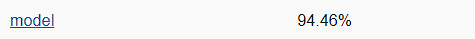

# Testing

## Tecnologie utilizzate

Per quanto riguarda il testing è stata utilizzata la libreria `ScalaTest`, uno dei tool più popolari per il testing in Scala. I vantaggi che abbiamo riscontrato usando questa libreria sono la semplicità di utilizzo e la leggibilità del codice che viene prodotto. Inoltre, i `Matchers` hanno reso possibile un ulteriore miglioramento nella leggibilità dei test grazie a asserzioni come `shouldBe` e `should`.

## Metodologie di testing

Per la scrittura dei test ci siamo ispirati all'approccio Test Driven Development (TDD). L'approccio non è stato sempre seguito in modo rigido, ma si è cercato sempre di scrivere i test contemporaneamente all'implementazione.

Sono state adottate diverse contromisure per essere sicuri che l'intera applicazione fosse ben testata e stabile:
- **PR rules**: è stata introdotta una regola per i branch `main` e `develop` che permette commit solo attraverso pull request  **necessariamente** approvate da uno sviluppatore e che, al tempo stesso, passino tutti i test presenti (ottenuto grazie ad alle [GitHub actions](1-processo.md)).
- **Coverage**: è stato aggiunto il plugin [scoverage](https://github.com/scoverage) che permette, attraverso un comando, di generare un file dove sono presenti tutte le percentuali di coverage per ogni singolo file, mostrando anche le righe e i logic branches che non sono stati testati.
- **SonarCloud**: un tool presente su github utilizzato parzialmente per avere un consiglio in più in fase di review delle pull request. Esso permette di individuare duplicazioni di codice non necessario e falle nella sicurezza. 

## Risultati coverage
Per quanto riguarda la coverage dell'applicazione si è cercato di dare enfasi al testing delle classi del model. Il controller e la view sono state testate attraverso test manuali e grafici, questo perchè i test servivano principalmente per feedback grafici.

Qui è riportato il risultato di `sbt clean coverage test`.

[Coverage del model](model.html)

---

0. [Introduzione](../README.md)
1. [Processo di sviluppo](1-processo.md)
2. [Requisiti](2-requisiti.md)
3. [Design architetturale](3-architettura.md)
4. [Design di dettaglio](4-design-dettaglio.md)
5. [Implementazione](5-implementazione.md)
    - [Francesco Carlucci](./implementazione/carlucci.md)
    - [Marco Raggini *(prev)*](./implementazione/raggini.md)
6. [Testing](6-testing.md)
7. [**Retrospettiva (next)**](7-retrospettiva.md)
